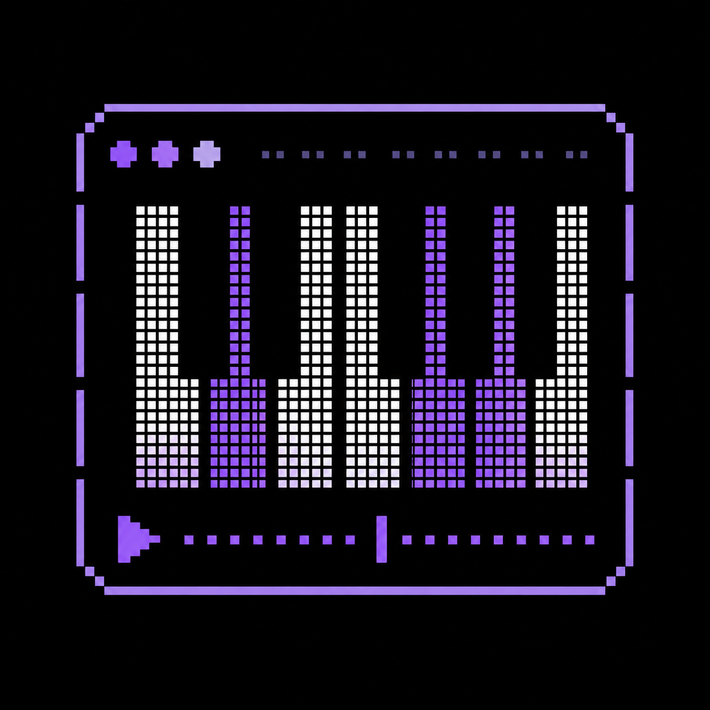
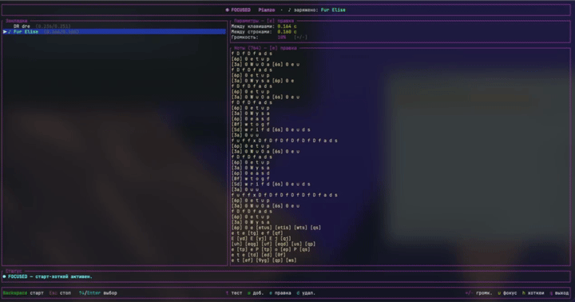

<p align="center">
  
</p>

<h1 align="center">Pianzo</h1>

<p align="center">
  TUI-автонажиматель нот на Rust. Проигрывает «мелодии» (последовательности клавиш) в активном окне с закладками, настраиваемыми глобальными хоткеями и фильтрацией по процессам.
</p>

---

## Возможности

- **TUI** на `ratatui`: список закладок, задержки, единое окно правки, статус.
- **Прожимает клавиши по системе** через `enigo` (в активном окне).
- **Настраиваемые глобальные хоткеи** (`rdev`) работают даже когда фокус в другом окне. По умолчанию: старт — `Ctrl+\`, стоп — `Esc`.
- **Закладки** мелодий: у каждой свои ноты и индивидуальные задержки. По файлу на мелодию в `~/Documents/Pianzo/tracks/<имя>.json`.
- **Создание и правка целиком в TUI**: маленькое окно имени → единое окно правки (ноты + задержки).
- **Тест (`t`)**: проигрывает мелодию фортепианными тонами (`rodio`) без эмуляции клавиш — с кароке-подсветкой. Громкость `+`/`-`.
- **Кароке-подсветка**: во время игры подсвечивается текущая строка и токен, сыгранное тускнеет; панель прокручивается за курсором.
- **Фильтрация по процессам**: воспроизведение разрешается или блокируется в зависимости от активного окна — нативно через `CGWindowListCopyWindowInfo` (macOS) и `GetModuleFileNameExW` (Windows).
- **Системные уведомления** macOS/Windows при старте, остановке и завершении воспроизведения.
- **Автообновление**: проверяет GitHub Releases при старте, скачивает и устанавливает новую версию прямо из TUI — без браузера и git.

## Формат нот

Тот же, что в оригинальном скрипте:

- токены разделяются пробелами, строки — переводом строки;
- `[abc]` — аккорд: символы нажимаются одновременно;
- одиночная **заглавная** буква = `Shift + буква`;
- спецсимволы `! @ # $ % ^ & * ( )` → `1 2 3 4 5 6 7 8 9 0`;
- задержка `between_keys` — после каждой группы, `between_lines` — после последней группы строки.

## Запуск

```bash
cargo run --release
```

Готовые бинари — в [Releases](https://github.com/SawGoD/pianzo-tui/releases).

| Платформа | Файл |
|-----------|------|
| macOS Apple Silicon (M1/M2/M3) | `pianzo-tui_silicon-apple.tar.gz` |
| macOS Intel | `pianzo-tui_intel-apple.tar.gz` |
| Windows x86-64 | `pianzo-tui_x86_64-windows.zip` |

## Управление

<details>
<summary><b>Главный экран</b></summary>

| Клавиша | Действие |
|---------|----------|
| `Ctrl+\` | старт **заряженной** (глобально, настраивается) |
| `Esc` | стоп (глобально, настраивается) |
| `↑` / `↓` / `k` / `j` | выбор наведённой закладки |
| `Enter` | **зарядить** наведённую (её играет старт) |
| `a` | добавить мелодию: имя → окно правки |
| `e` | правка **наведённой** |
| `S` | сохранить наведённую под именем (копия) |
| `d` | удалить **наведённую** |
| `t` | тест наведённой: звук + кароке (стоп — `Esc`) |
| `+` / `-` | громкость звука |
| `u` | FOCUSED / UNFOCUSED — вкл/выкл ловлю старт-хоткея |
| `s` | открыть настройки |
| `p` | старт заряженной из TUI |
| `q` | выход |

> **Наведённая** — под курсором: правка/удаление/тест.
> **Заряженная** (`Enter`) — её играет глобальный старт. Помечена `♪` в списке.

</details>

<details>
<summary><b>Окно правки (<code>e</code>)</b></summary>

- `Tab` / `Shift+Tab` — переключение фокуса: **Имя → Ноты → Задержки**;
- **Задержки**: `↑/↓` — поле, `←/→` — `±0.001`, цифры/`.`/`,` — ввод вручную;
- `Esc` — сохранить, `Ctrl+Q` — отменить.

</details>

<details>
<summary><b>Настройки (<code>s</code>)</b></summary>

| Раздел | Содержимое |
|--------|------------|
| **Общие** | задержки по умолчанию, пауза перед воспроизведением, ведение логов |
| **Хоткеи** | переназначить старт/стоп, сброс к стандартным (`Ctrl+Backspace`) |
| **Уведомления** | системные уведомления по событиям |
| **Процессы** | фильтрация по активному окну |
| **Обновления** | проверка и установка новой версии |

Навигация: `↑/↓` — выбор раздела, `→` / `Enter` — войти, `←` / `Esc` / `q` — назад/закрыть.

</details>

## Фильтрация по процессам



В разделе **Настройки → Процессы** можно задать список приложений и режим для каждого:

- **Отслеживать** (зелёный) — воспроизведение разрешено только когда это окно в фокусе;
- **Игнорировать** (красный) — воспроизведение заблокировано;
- **Не задано** (серый) — процесс добавлен, используется FOCUSED/UNFOCUSED.

Когда фильтрация включена, в правой части статус-бара отображается имя активного окна (цвет отражает режим).

## Тест звуком (`t`)

Токены трактуются как раскладка **Virtual Piano**: 36 «белых» клавиш (`1234567890qwerty…`), Shift — диез. Синтез через `rodio`, аккорды `[...]` звучат одновременно. Это предпрослушивание — клавиши не нажимаются.

## FOCUSED / UNFOCUSED (`u`)

Клавиша `u` переключает реагирование на глобальный старт-хоткей:

- **FOCUSED** (по умолчанию) — старт-хоткей активен.
- **UNFOCUSED** — старт-хоткей отключён. Удобно, когда TUI запущена, но работаешь в другом окне. Стоп-хоткей при этом продолжает работать.

## Автообновление

При запуске TUI тихо проверяет наличие новой версии на GitHub. Если есть — в статус-баре появляется `↑ v0.x.x`. Установить можно прямо из **Настройки → Обновления** — без браузера и git, только интернет.

<details>
<summary><b>Права доступа</b></summary>

### macOS

Нужны два разрешения в **System Settings → Privacy & Security**:

- **Accessibility** — чтобы `enigo` мог нажимать клавиши;
- **Input Monitoring** — чтобы `rdev` ловил глобальные хоткеи.

### Windows

Особых разрешений не требуется. Клавиши шлются по **Virtual-Key кодам** (`VK_*`), раскладка не влияет. Запускать лучше в **Windows Terminal**.

> Античит в некоторых играх может блокировать синтетический ввод — это ограничение игры, не утилиты.

</details>

## Раскладка клавиатуры

Клавиши шлются по фиксированным **US-ANSI keycode'ам**, поэтому ноты нажимаются правильно при любой активной раскладке (в т.ч. русской).

## Хранилище

```
Documents/Pianzo/
├── tracks/             # мелодии — по файлу на каждую (<имя>.json)
│   └── Für Elise.json
├── config.json         # хоткеи, громкость, уведомления, процессы
└── pianzo-tui.log      # лог отладки (вкл/выкл в Настройки → Общие)
```

Каталог создаётся автоматически при первом запуске.
