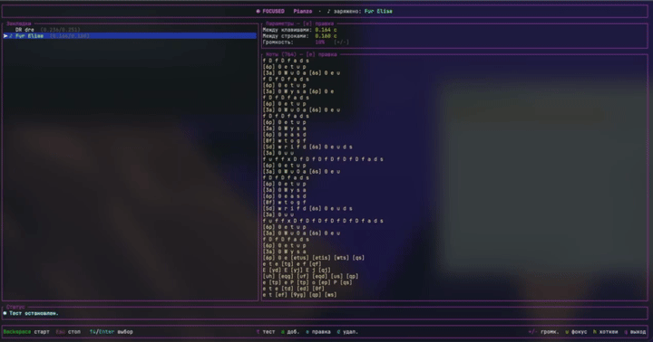

# Pianzo

TUI-автонажиматель нот на Rust. Проигрывает «мелодии» (последовательности
клавиш) в активном окне — порт `main.py` с интерфейсом, настраиваемыми
глобальными хоткеями и закладками.

## Возможности

- **TUI** на `ratatui`: список закладок, задержки, единое окно правки, статус.
- **Прожимает клавиши по системе** через `enigo` (в активном окне).
- **Настраиваемые глобальные хоткеи** (`rdev`) работают даже когда фокус в
  другом окне. По умолчанию: старт — `Ctrl+\`, стоп — `Esc`. Меняются по `h`.
- **Закладки** мелодий: у каждой свои ноты *и* индивидуальные задержки.
  По файлу на мелодию в `~/Documents/Pianzo/tracks/<имя>.json`.
- **Создание и правка целиком в TUI**: маленькое окно имени → единое окно
  правки (ноты + задержки).
- **Караоке-подсветка**: во время игры подсвечивается текущая строка и
  проигрываемый токен, сыгранное тускнеет; панель прокручивается за курсором.
- **Тест (`t`)**: проигрывает мелодию как фортепианные тоны (синтез, `rodio`)
  без эмуляции клавиш — с той же караоке-подсветкой. Громкость по умолчанию
  50%, регулируется `+`/`-`. Остановка — глобальным стоп-хоткеем (`Esc`).

## Формат нот

Тот же, что в оригинальном скрипте (старые мелодии играются идентично):

- токены разделяются пробелами, строки — переводом строки;
- `[abc]` — аккорд: символы нажимаются одновременно (приводятся к нижнему регистру);
- одиночная **заглавная** буква = `Shift + буква`;
- спецсимволы мапятся в цифры: `! @ # $ % ^ & * ( )` → `1 2 3 4 5 6 7 8 9 0`;
- задержка `between_keys` — после каждой группы внутри строки,
  `between_lines` — после последней группы строки.

## Запуск

```bash
cargo run --release
```

## Релизы

Готовые бинари (macOS Apple Silicon/Intel, Windows x64) собираются автоматически
при пуше тега `vX.Y.Z` через GitHub Actions (`.github/workflows/release.yml`):

```bash
git tag v0.1.0
git push origin v0.1.0
```

Workflow соберёт три цели и приложит архивы к GitHub Release:
`pianzo-tui-<target>.tar.gz` (mac) и `pianzo-tui-x86_64-pc-windows-msvc.zip`.

### Управление (главный экран)

| Клавиша      | Действие                                  |
|--------------|-------------------------------------------|
| `Ctrl+\`     | старт **заряженной** (глобально, настраивается) |
| `Esc`        | стоп (глобально, настраивается)           |
| `↑/↓`        | выбор наведённой закладки                  |
| `Enter`      | **зарядить** наведённую (её играет старт)  |
| `a`          | добавить мелодию: имя → окно правки        |
| `e`          | правка **наведённой**                      |
| `s`          | сохранить наведённую под именем (копия)    |
| `d`          | удалить **наведённую**                     |
| `t`          | **тест наведённой**: звук + караоке (стоп — `Esc`) |
| `+` / `-`    | громкость звука                            |
| `u`          | FOCUSED/UNFOCUSED — вкл/выкл ловлю старт-хоткея |
| `h`          | настройка хоткеев старта/стопа             |
| `p`          | старт заряженной из TUI                    |
| `q`          | выход                                      |

> **Наведённая (hovered)** — под курсором: с ней работают правка/удаление/тест.
> **Заряженная (Enter)** — её играет глобальный старт. Это разные вещи: можно
> править/тестить одну, пока заряжена другая. Заряженная помечена `♪` в списке
> и показана в заголовке; справа — превью наведённой.

### Окно правки (`e`)

Раскладка: сверху **Имя** (слева) и **Клавиши/Строки** (справа, 2 строки),
ниже через полосу — **Ноты**, внизу через полосу — подсказки хоткеев.

- `Tab` — переключение фокуса: **имя → ноты → задержки** (по кругу);
- **имя** — можно переименовать мелодию (старый файл удаляется, создаётся новый);
- **ноты** — обычный многострочный редактор;
- **задержки**: `↑/↓` — поле (Клавиши/Строки), `←/→` — `±0.001`,
  цифры и `.`/`,` — ввод вручную (запятая → точка), `Backspace` — стереть;
- `Esc` — сохранить, `Ctrl+Q` — отменить.

### Настройка хоткеев (`h`)

`1` — переназначить старт, `2` — стоп. Затем нажмите нужную комбинацию
(например `Ctrl+\`). `Ctrl+Backspace` — сброс к стандартным (`Ctrl+\` / `Esc`).
`Esc` — закрыть. Сохраняется в `config.json`.

### Типичный сценарий

1. Выбрать закладку (`Enter`) или создать мелодию (`a`).
2. Нажать `Ctrl+\` — начнётся **обратный отсчёт 3 секунды** (виден в статусе).
3. За это время переключиться в нужное окно (игра/приложение).
4. Идёт воспроизведение с караоке-подсветкой. `Esc` — остановить.

## FOCUSED / UNFOCUSED (`u`)


Клавиша `u` переключает реагирование на глобальный старт-хоткей:

- **FOCUSED** (по умолчанию) — интерфейс фиолетовый, старт-хоткей активен.
- **UNFOCUSED** — рамки белые, старт-хоткей **не срабатывает**. Удобно, когда
  TUI запущена, но ты работаешь в другом окне (браузер и т.п.) и не хочешь
  случайных запусков. Стоп-хоткей (отмена) при этом продолжает работать.

Состояние крупно подписано сверху (`● FOCUSED` / `○ UNFOCUSED`).

## Тест звуком (`t`)



Токены трактуются как раскладка **Virtual Piano**: 36 «белых» клавиш в ряд
(`1234567890qwerty…`), а Shift (заглавная буква или спецсимвол `!@#…`) —
диез (+1 полутон). Эти высоты синтезируются в фортепианные тоны (`rodio`),
аккорды `[...]` звучат одновременно, тайминг — те же задержки мелодии.
Идёт **караоке-подсветка** проигрываемой ноты. Абсолютная октава условна
(мелодия звучит верно относительно себя). Это **не** эмуляция клавиш —
просто предпрослушивание. Стоп — глобальный стоп-хоткей.

## Раскладка клавиатуры

Клавиши шлются по фиксированным **US-ANSI keycode'ам** (как в исходном
`pyautogui`), поэтому ноты нажимаются правильно при любой активной раскладке
(в т.ч. русской). Раньше при не-латинской раскладке проигрывалось «aaaa».

## Отладка

Лог пишется в `~/Documents/Pianzo/pianzo-tui.log` (старты/остановки,
ошибки ввода, паники). Если что-то падает — пришли этот файл.

## Права доступа (macOS)

Нужны два разрешения в **System Settings → Privacy & Security**:

- **Accessibility** — чтобы `enigo` мог нажимать клавиши;
- **Input Monitoring** — чтобы `rdev` ловил глобальные хоткеи.

Дай их терминалу (или собранному бинарю). Если хоткеи не работают —
в статусе появится подсказка.

## Windows 11

Особых разрешений не требуется. Клавиши шлются по фиксированным
**Virtual-Key кодам** (`VK_*`), поэтому раскладка не влияет — как и на macOS.
Глобальные хоткеи (`rdev`) и эмуляция ввода (`enigo`) работают «из коробки».
Запускать лучше в **Windows Terminal** (на Win11 — по умолчанию).

> Античит в некоторых играх может блокировать синтетический ввод —
> это ограничение самой игры, а не утилиты.

## Хранилище

```
Documents/Pianzo/
├── tracks/          # мелодии — по файлу на каждую (<имя>.json)
│   └── Für Elise.json
├── config.json      # хоткеи + громкость
└── pianzo-tui.log    # лог отладки
```

Каталог создаётся автоматически при первом запуске
(`~/Documents` на macOS/Linux, `%USERPROFILE%\Documents` на Windows).
Мелодии из старого расположения (`Pianzo/*.json`) переносятся в `tracks/`
автоматически.
